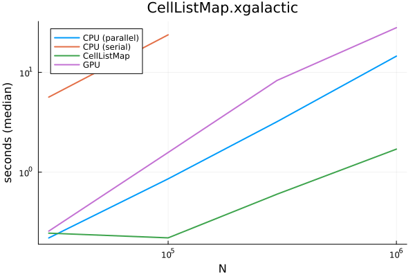
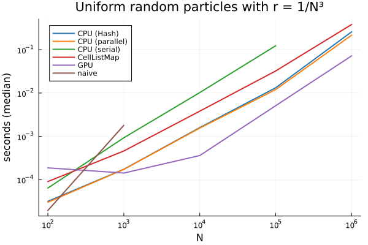

# SpatialHashTables
<!-- 
[](https://SteffenPL.github.io/SpatialHashTables.jl/stable/) -->

[](https://SteffenPL.github.io/SpatialHashTables.jl/dev/)
[](https://github.com/SteffenPL/SpatialHashTables.jl/actions/workflows/CI.yml?query=branch%3Amain)
[](https://codecov.io/gh/SteffenPL/SpatialHashTables.jl)

**This package is not stable yet and work in progress! Consider using [CellListMap.jl](https://github.com/m3g/CellListMap.jl) instead if you need a fast and well-tested Julia implementation.**

Please use `import Pkg; Pkg.add("https://github.com/SteffenPL/SpatialHashTables.jl")` to use the latest version, I didn't update the registered version yet.

## Aim 

Creates spatial hash tables on bounded and unbounded domains for fast 
computations of pairwise interaction terms. Updating the hash table is 
done in $\mathcal{O}(n)$ time and allocation free. Iteration over neigbour lists 
is also allocation free and supports CPU and GPU parallelization.

The interface is minimalistic. For a more full-featured and established package, see [CellListMap.jl](https://github.com/m3g/CellListMap.jl).

See the [benchmarks](https://github.com/SteffenPL/SpatialHashTables.jl/tree/main/benchmarks) folder for some timings and performance comparisons.

## How does it work?

***The package is currently undergoing many changes. Documentation will be updated soon.***


The current typical useage looks like this
```julia
using SpatialHashTables, StaticArrays
using SpatialHashTables: dist²

X = [@SVector randn(3) for i in 1:10_000]
cutoff = 0.1

grid = HashGrid(cutoff, 1000, X)

for i in 1:10_000
    for j in neighbours(grid, X[i], cutoff)
        Xij = X[i] - X[j]
        if dist²(Xij) < cutoff^2
            # ... 
        end
    end
end
```

## Parallelization

With KernelAbstractions.jl we can generate CPU/GPU parallel code. 

```julia
# continuing the script above

# 1. prepare grid for GPU! 
using KernelAbstractions, CUDA 
using SpatialHashTables, StaticArrays
using SpatialHashTables: dist²

backend = CUDABackend()  # or CPU()
FT = Float32

X_gpu = adapt(backend, SVector{3,Float32}.(X))
F_gpu = similar(X_gpu)

cutoff_gpu = FloatT(cutoff)

# important: 4th argument determines internal index list type!
grid_gpu = HashGrid(cutoff_gpu, 1000, X_gpu, CuVector{Int32})


@kernel function compute_something!(F, @Const(X), grid, cutoff)
    i = @index(Global) 

    Xi = X[i]
    Fi = zero(Xi)

    FL = eltype(Xi) # make sure we only use Float32!!!

    cutoff² = cutoff^2

    for j in neighbours(grid, Xi, cutoff)
        Xij = Xi - X[j]
        d² = dist²(Xij)

        if d² < cutoff²
            Fi += FL(1)/sqrt(d²) * (Xij)
        end
    end

    F[i] = Fi
end


# prepare kernel
numthreads = 32
K = compute_something!(grid_gpu.backend, numthreads, length(X))


# usage
updatecells!(grid_gpu, X_gpu)           # uses parallel implementation!
K(F_gpu, X_gpu, grid_gpu, cutoff_gpu)

# maybe needed...
KernelAbstractions.synchronize(backend)
```

The above code should work with small changes on any backend compatible with KernelAbstractions.jl. 

## Constructors and main functions

All constructors follow the principle that one first defines the `cutoff`, then the data needed to determine the number of partitions used to create grid and finally the points `X` which are expected to be a `Vector` (or `CuVector` etc) of `SVector`s.  

The fourth argument might be a backend specific type suitable for storing indices, e.g. `CuVector{Int32}`, per default, `Vector{Int64}` is used.

In addition, one might define `nthreads` and `backend` as keywoard arguments. 

The following constructors give a unbounded `HashGrid`:

```julia
HashGrid(cutoff, tablesize, X; nthreads = 16, backend = get_backend(X))
HashGrid(cutoff, tablesize, X, CuVector{Int32})
```

For `BoundedGrid`s it is not sufficient to determine how a number, but instead one needs to provide the `gridsize` which determines
how many unique cells are created in each direction (and then periodically continued). 

Note, that one can also provide a `SVector{Dim, Float}` to alternatively define the physical size of the `grid` (e.g. `domainsize = cutoff .* gridsize`). Dispatch is used to differentiated `gridsize::NTuple{Dim,Int}` and `domainsize::SVector{Dim,Float64}`.

Optionally, one might shift the grid by the `origin` keyword.

Other than that, the `BoundedGrid` has the same optional 4th arguemnt to determine the index type and the same keyword arguments for `nthreads` and `backend`.

```julia
gridsize = (100, 100, 100)::NTuple{3,Int}
BoundedGrid(cutoff, gridsize, X; origin = SA[0.0, 0.0, 0.0], ...)
BoundedGrid(cutoff, gridsize, X, CuVector{Int32})

domainsize = @SVector [2.0, 1.0, 2.0]
BoundedGrid(cutoff, domainsize, X; origin = SA[0.0, 0.0, 0.0], ...)
```

### Update tables 

A parallel version of updating the cell lists is given by `updatecells!(grid, X)` where `X` is a vector of static vectors:
```julia
updatecells!(grid, X)
```

### Iterate neigbours

Iteration of closeby points to a given position is done via the iterator `neigbours(grid, pos, cutoff)`.
(Note: For `HashGrid` is is needed that `cutoff` is less than the cutoff used to initialize the `grid`.)

```julia 
pos = @SVector[0.5, 0.5, 0.5]

for j in neighbours(grid, pos, cutoff)
    # ...
end
```

## Performance benchmarks

These are the current performance benchmarks (see `benchmarks/report` folder for the implementation of the benchmark). 

Notably, the package is approaching the performance of NVIDIA Warp's HashGrid. For benchmarks with only a few particles per box (`uniform`) the performance is already good, for benchmarks with many particles per box (`xatomic`) [CellListMap.jl](https://github.com/m3g/CellListMap.jl) is faster.

<div>

<!---->

</div>

## Documentation 

Please let me know if the [documenation](https://SteffenPL.github.io/SpatialHashTables.jl/dev/) is unclear or if you have any suggestions for improvements.
