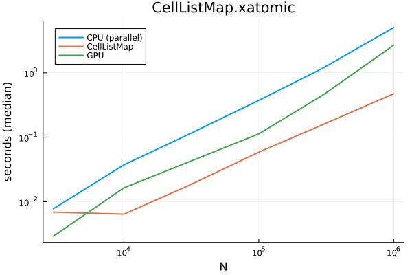
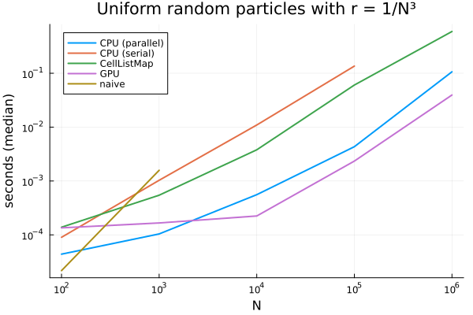

# SpatialHashTables
<!-- 
[](https://SteffenPL.github.io/SpatialHashTables.jl/stable/) -->

[](https://SteffenPL.github.io/SpatialHashTables.jl/dev/)
[](https://github.com/SteffenPL/SpatialHashTables.jl/actions/workflows/CI.yml?query=branch%3Amain)
[](https://codecov.io/gh/SteffenPL/SpatialHashTables.jl)

**This package is not stable yet and work in progress! Consider using [CellListMap.jl](https://github.com/m3g/CellListMap.jl) instead if you need a fast and well-tested Julia implementation.**

Please use `import Pkg; Pkg.add("https://github.com/SteffenPL/SpatialHashTables.jl")` to use the latest version, I didn't update the registered version yet.

## Aim 

Creates spatial hash tables on bounded and unbounded domains for fast 
computations of pairwise interaction terms. Updating the hash table is 
done in $\mathcal{O}(n)$ time and allocation free. Iteration over neigbour lists 
is also allocation free and supports CPU and GPU parallelization.

The interface is minimalistic. For a more full-featured and established package, see [CellListMap.jl](https://github.com/m3g/CellListMap.jl).

See the [benchmarks](https://github.com/SteffenPL/SpatialHashTables.jl/tree/main/benchmarks) folder for some timings and performance comparisons.

## How does it work?

***The package is currently undergoing many changes. Documentation will be updated soon.***


The current typical useage looks like this
```julia
using SpatialHashTables, StaticArrays, LinearAlgebra
const SVec3d = SVector{3,Float64}

N = 10_000
r = 1/N^3
X = rand(SVector{3, Float64}, N)
lower = SVec3d(0,0,0)
upper = SVec3d(1,1,1)

grid = HashGrid(X, lower, upper, r)
# updatecells!(grid, X)  # will be called automatically above

F = similar(X)

for i in eachindex(X)
    Xi = X[i]
    for j in HashGridQuery(grid, Xi, r)
        Xij = Xi - X[j]

        d = norm(Xij)
        if d < r
            # compute something
            F[i] += Xij / d
        end
    end
end
```

With KernelAbstractions.jl we can generate CPU/GPU parallel code. 

```julia
# continuing the script above
using CUDA, KernelAbstractions
const SVec3f = SVector{3,Float32}
IndexType = CUDA.CuVector{Int32}  # specify index type

X_gpu = cu(SVecf.(X))
r_gpu = Float32.(r)
bnds_gpu = SVec3f.((lower, upper))

grid_gpu = Hash{IndexType}(X_gpu, bnds_gpu..., r_gpu)
# one might want to use `nthreads` kwarg above. 


# implement kernel for force computation
@kernel function force_kernel!(F, @Const(X), r, grid)
    i = @index(Global)
    
    Xi = X[i]
    Fi = zero(eltype(F))
    r² = r^2

    for j in HashGridQuery(grid, Xi, r)
        Xij = Xi - X[j]
        d² = sum(z -> z^2, Xij)
        if zero(r) < d² < r²
            Fi += Xij / sqrt(d²)
        end 
    end
    F[i] = Fi    
end

# call kernel
F_gpu = similar(X_gpu)

force_kernel!(grid_gpu.backend, numthreads(grid_gpu))(
        F_gpu, X_gpu, r_gpu, grid_gpu, ndrange = length(X_gpu)
    )
```

The above code should work with small changes on any backend compatible with KernelAbstractions.jl. 

## Performance benchmarks

These are the current performance benchmarks (see `benchmarks/report` folder for the implementation of the benchmark). 

Notably, the package is approaching the performance of NVIDIA Warp's HashGrid. For benchmarks with only a few particles per box (`uniform`) the performance is already good, for benchmarks with many particles per box (`xatomic`) [CellListMap.jl](https://github.com/m3g/CellListMap.jl) is faster.

<div>

<!---->

</div>

## Documentation 

Please let me know if the [documenation](https://SteffenPL.github.io/SpatialHashTables.jl/dev/) is unclear or if you have any suggestions for improvements.
